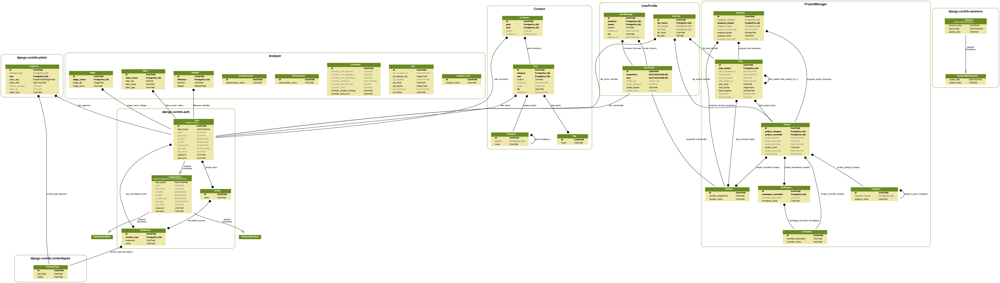

# Project Summa
## [under construction]
### Django based machine learning analysis reporting service.
### main apps
* Analyzer : reports on preprocessing, feature engineering, classification/regression results for user-input datasets.
* ProjectManager : manages projects and visualize task lists.

## ERD

## under debug mode
- rabbitmq-server
- celery -A SummaMLEngine worker -E
- python3 quiver_test
- python3 manage.py graph_models --pygraphviz -a -o test.png

## function description
- machine learning reporting with image, table data input.

## requirements
- tensorflow, scikit-learn, keras
- mpld3
- quiver

## css templates and reference
- https://html5up.net/aerial
- https://github.com/jakebian/quiver

## Author
free to change under MIT license.
TedJeong

## upto/todo
anaylzer:
file upload - user profile
job to job list
uesr:
userprofile
